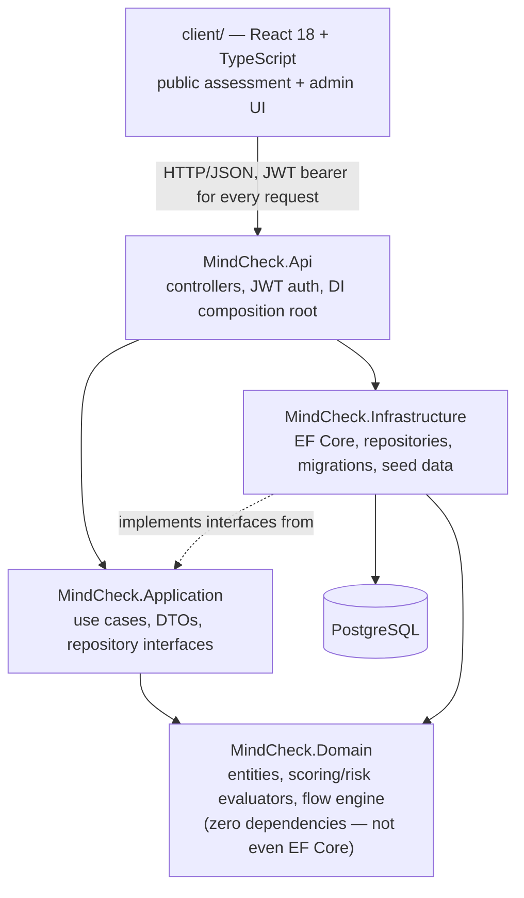
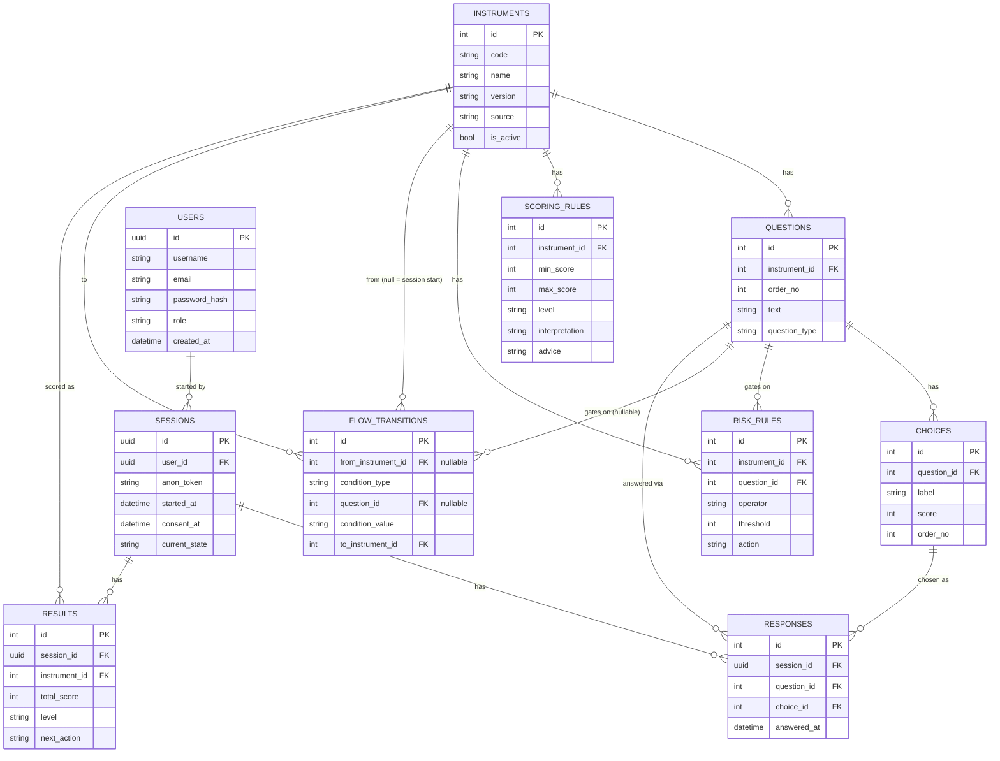

# MindCheck

MindCheck is a stress and depression-risk screening web app (ST-5 and the
Thai Department of Mental Health's 2Q→9Q→8Q cascade) built as a **portfolio
demo of system design**, not a clinical tool — the goal was to prove that
scoring cut-offs, risk rules, and the branching flow between assessments can
all live entirely in data (creatable and rewireable through an admin UI, at
runtime, with no code change or restart) rather than hardcoded in the
backend. Every page in the app says so explicitly; nothing here should be
used to make a real health decision.

**Demo:** not deployed publicly yet — Docker images build and run correctly
(see below and [DEPLOY.md](DEPLOY.md)), but an actual Railway deployment
needs the project owner's own account. See "ข้อจำกัดที่รู้ตัว" below.

**Screenshots:** not attached to this document yet — the tooling used to
build this project can drive a real browser and verify behavior, but has no
way to export an image file into the repo. See "ข้อจำกัดที่รู้ตัว" below for
what to do about it. In the meantime, "วิธีรันในเครื่อง" gets you the real
running app in a couple of commands.

## Architecture



Dependencies point one way (see [ADR 0001](docs/adr/0001-layered-architecture-dependency-direction.md)).
The flow between assessments — which instrument comes after which, under
what condition — is a state machine read from the `flow_transitions` table
at runtime, not an if/else chain in code; [ADR 0003](docs/adr/0003-assessment-flow-engine-safety-short-circuit.md)
and [ADR 0011](docs/adr/0011-instrument-creation-is-one-composite-endpoint.md)
cover how that stays true even for instruments created after the app has
already started. Full decision log: [docs/adr/](docs/adr/).

## Data model



## วิธีรันในเครื่อง

Full stack (Postgres + Api + client), verified working end to end:

```bash
docker compose up --build
```

- Client: http://localhost:18081
- Api + Swagger: http://localhost:18080/swagger
- Bootstrap admin login (this compose file only, not a real secret): username `admin`, password `adminadmin` — seeded once at first startup; after that, manage admins via the "จัดการผู้ใช้" (user management) admin page, not this config value

Or run the .NET side locally against just a containerized Postgres:

```bash
docker compose up -d db
dotnet run --project MindCheck.Api
```

and the client separately for hot reload:

```bash
cd client
npm install
npm run dev
```

Run the test suite (unit tests + Testcontainers-based integration tests,
including the one that proves an admin-created instrument is reachable
without a restart):

```bash
dotnet test
```

Deploying to Railway: see [DEPLOY.md](DEPLOY.md).

## ข้อจำกัดที่รู้ตัว

Being upfront about what's not done — and why — is part of the point of this
project, not an afterthought.

**Content is placeholder, on purpose:**
- Every question's text (`[PLACEHOLDER] ... ข้อที่ N`, all 24 of them) is
  filler. Real ST-5/2Q/9Q/8Q wording was always meant to be supplied by the
  project owner directly, not guessed at by whoever writes the code.
- Every scoring cut-off and risk threshold in `SeedData.cs` is dummy data
  (`Source = "PLACEHOLDER-DO-NOT-USE-CLINICALLY"`), invented only to exercise
  the engine end to end. Real cut-offs need a real public reference, not an
  AI's guess at clinical thresholds.

**Real accounts now exist, but auth is still not production-grade**
([ADR 0014](docs/adr/0014-unified-user-accounts-with-roles.md), supersedes
[ADR 0012](docs/adr/0012-admin-auth-single-password-jwt.md)):
- People taking the assessment and admins share one `Users` table with a
  `Role` (`Admin`/`User`), real per-user passwords hashed via
  `Microsoft.Extensions.Identity.Core`'s `PasswordHasher<T>` — not the old
  single shared plaintext password.
- Still missing: no lockout after failed login attempts, no rate limiting on
  `/api/auth/login` or `/api/auth/register` (anyone can script-create many
  named accounts).
- JWTs still aren't revocable — a leaked token stays valid until it expires
  (8h default). No refresh tokens, no "log out everywhere."
- This is fine for a portfolio demo's threat model. It is not fine for
  anything holding real user data.
- **The app's earlier "no need to reveal your identity" anonymity pitch is
  gone on purpose** — taking the assessment now requires a real account. This
  is a deliberate product trade-off (see ADR 0014), not an oversight.

**Operational gaps:**
- No CI pipeline — tests are run manually (`dotnet test`), not on push.
- `Database.Migrate()` runs on every Api startup. Fine for one instance; a
  real multi-instance deploy would need a separate migration step to avoid
  concurrent-migration races.
- No rate limiting or abuse protection on the public session endpoints —
  a registered user can still start unlimited sessions.
- No admin audit log — nothing records *who* created an instrument or
  deleted a flow transition, only that it happened.
- The admin UI can create instruments and flow transitions but not edit or
  disable an existing one; fixing a mistake means adding new data around it
  or going into the database directly.
- Nothing validates the flow graph itself (unreachable instruments, cycles)
  ahead of time — a bad `flow_transitions` row is only discovered when a
  real session walks into it.

**Not tested the way you might expect:**
- The "create an instrument via the admin API, then take it in a live
  session, no restart" proof ([ConfigDrivenInstrumentTests.cs](MindCheck.Tests/Integration/ConfigDrivenInstrumentTests.cs))
  is an HTTP-level integration test (xUnit + Testcontainers), not a browser
  automation test (no Playwright/Cypress in this stack) — see
  [ADR](docs/adr/) discussion around phase 4 for why. It calls the exact same
  endpoints the admin UI calls, but it doesn't click through the UI itself.
  The UI path was additionally verified once by hand during development, not
  as an automated, repeatable test.
- WCAG AA (contrast, keyboard operability) was checked manually once during
  phase 3, not with an automated tool (axe, Lighthouse CI) that would catch
  a future regression.
- `sessions.consent_at` is always equal to `started_at` in practice — the
  schema allows a session to exist before consent is recorded, but the
  current single `POST /api/sessions` endpoint always does both at once, so
  that flexibility is unexercised.

**Frontend:**
- Recharts adds real weight to the client bundle (~400KB) with no
  code-splitting done — acceptable for a demo, worth revisiting if this ever
  needs to load fast on a slow connection.
